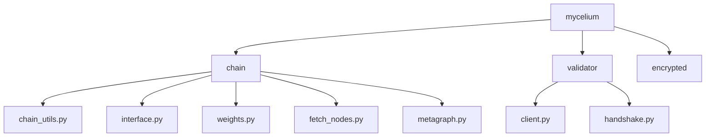
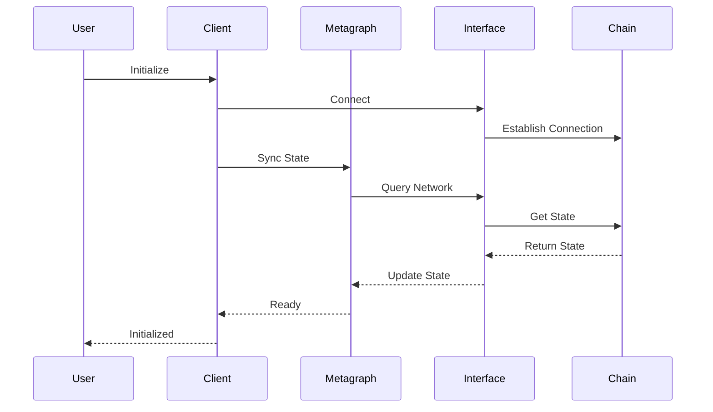

# Mycelium Python Package Architecture

## Overview

The Mycelium Python package provides a comprehensive interface for interacting with the Mycelium network. It serves as a drop-in replacement for the Fiber library, offering enhanced functionality and improved reliability.

## Package Structure

## Core Components

### Root Package (`mycelium/`)
- `__init__.py`: Package initialization, version information, and exports of core modules
  - Exports: `chain`, `encrypted`
  - Version: 0.1.0
  - Author: Mycelium Contributors

### Chain Package (`mycelium/chain/`)

#### `interface.py`
- Low-level substrate interface for Mycelium network
- Handles direct communication with substrate nodes
- Features:
  - Connection management with retry logic
  - Storage queries (single and map)
  - Extrinsic submission
  - Block information retrieval
  - Account queries
  - Storage subscriptions
  - Custom error handling

#### `chain_utils.py`
- High-level chain interaction utilities
- Bridges Go substrate client with Python
- Key features:
  - Substrate connection management
  - Stake operations
  - Signature verification
  - Axon endpoint registration
  - Network queries
  - Block information

#### `weights.py`
- Weight management and normalization utilities
- Features:
  - Weight normalization functions
  - Conversion between float and u16 formats
  - Weight validation
  - Weight matrix computation

#### `fetch_nodes.py`
- Node discovery and filtering utilities
- Features:
  - Active node retrieval
  - Filtering by:
    - Stake amount
    - Rank
    - Trust score
    - Consensus score
    - Incentive
    - Dividends
    - Emission
    - Version
    - Prometheus availability
  - Multi-criteria node selection

#### `metagraph.py`
- Network state management and queries
- Features:
  - Network state synchronization
  - Validator information tracking
  - Weight matrix management
  - Network statistics
  - Performance metrics

### Validator Package (`mycelium/validator/`)

#### `client.py`
- Validator client implementation
- Features:
  - Weight setting
  - Axon endpoint management
  - Stake operations
  - Registration verification
  - Prometheus integration

#### `handshake.py`
- Validator handshake protocol implementation
- Features:
  - Secure connection establishment
  - Credential verification
  - Protocol version negotiation

### Encrypted Package (`mycelium/encrypted/`)
- Cryptographic utilities and secure communication
- *Note: Implementation details pending*

## Dependencies

- `substrate-interface`: Core substrate communication
- `py-sr25519-bindings`: Cryptographic operations
- `py-ed25519-zebra-bindings`: Additional cryptography support
- `py-bip39-bindings`: Mnemonic handling
- `base58`: Address encoding
- `cryptography`: General cryptographic operations
- `pycryptodome`: Additional cryptographic primitives

### Optional Dependencies
- `numpy`: Numerical operations
- `pandas`: Data handling
- `torch`: Machine learning support

## Data Flow

## Security Considerations

1. All network communications are encrypted
2. Private keys never leave the client
3. Signature verification for all operations
4. Retry logic with exponential backoff
5. Error handling at all layers
6. Input validation for all public methods

## Extension Points

1. Custom validator implementations
2. Additional cryptographic schemes
3. New network protocols
4. Custom weight strategies
5. Alternative node selection algorithms 