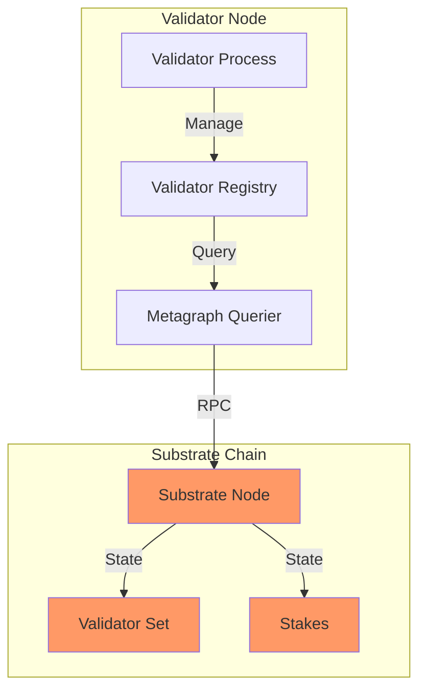
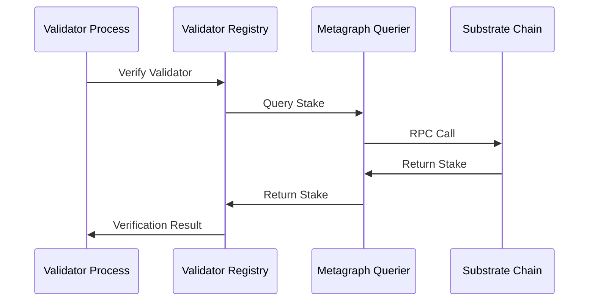
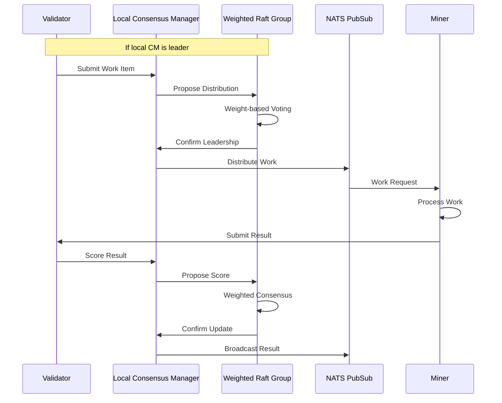
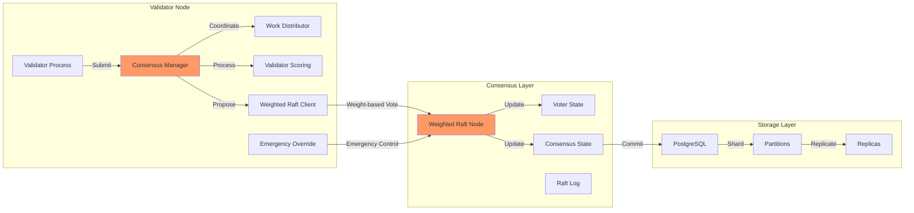
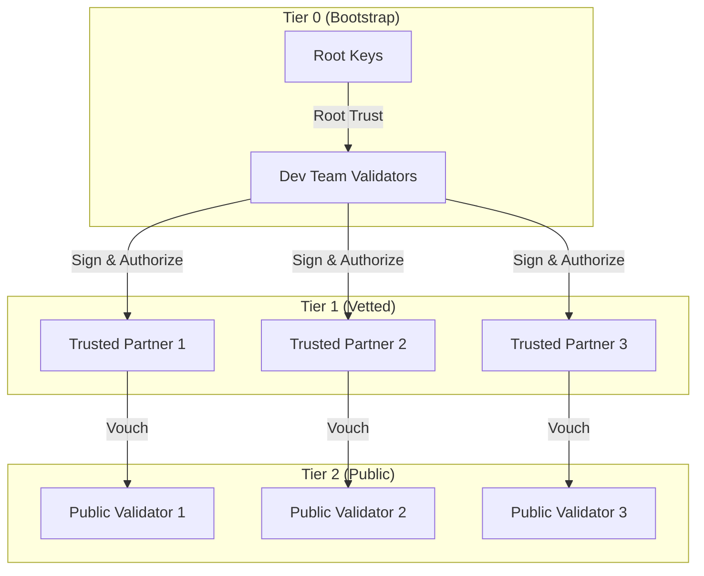
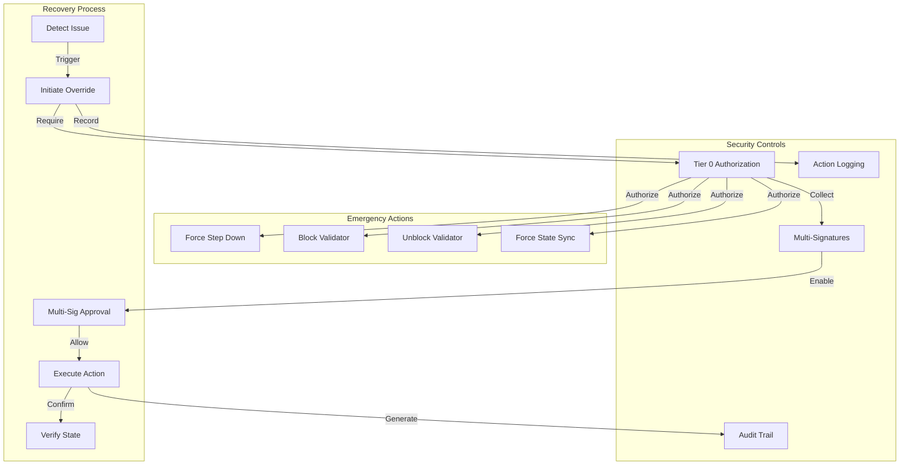

# Mycelium Architecture

## Overview

Mycelium is a distributed data store system with role-based access control, designed to support a network of validator nodes (which participate in consensus) and miner nodes (which process work). Each validator node runs a Consensus Manager component, with leadership determined through weighted Raft election based on validator tiers and performance metrics.

## System Components

### 1. Core Packages

#### metagraph
- Direct interaction with the Substrate blockchain
- Queries validator information, stakes, and network state
- Handles all blockchain-related operations through the Go Substrate RPC client
- No Python dependencies or bridges required

#### peer
- Manages validator discovery and status tracking
- Maintains registry of active validators
- Handles peer verification and stake checking
- Uses metagraph for blockchain queries

#### util
- Common utilities shared across packages
- IP address handling and validation
- Network-related helper functions

## System Architecture Diagram



## Component Interactions

### 1. Validator Verification Flow



### 2. Data Architecture

#### Direct Substrate Integration
- Uses go-substrate-rpc-client for chain interaction
- No intermediate Python or gRPC layers
- Efficient direct state queries
- Real-time stake and validator information

#### Validator Registry
- In-memory cache of validator status
- Periodic cleanup of inactive validators
- Thread-safe concurrent access
- Configurable minimum stake requirements

### 3. Security Model

#### Stake-based Validation
- Minimum stake requirement for validators
- Real-time stake verification through Substrate
- Automatic deactivation of validators below minimum stake
- Cached validation results with configurable TTL

#### Network Security
- IP address validation and sanitization
- Port range validation
- SS58 address format verification
- Signature verification for all operations

## Future Considerations

### 1. Planned Enhancements
- Enhanced caching strategies for blockchain queries
- Batch query optimizations
- Connection pooling for Substrate RPC
- Advanced validator scoring metrics

### 2. Scalability
- Horizontal scaling of validator nodes
- Load balancing of blockchain queries
- Optimized state synchronization
- Enhanced peer discovery mechanisms

## Work Distribution Flow



## Consensus Architecture



## Core Components

### 1. Node Types

#### Validators
- Primary nodes with read/write access
- Each runs a Consensus Manager component
- Participates in Raft consensus groups
- Leader election per shard
- Must sign all data modifications
- Responsible for work distribution and scoring

#### Miners
- Read-only access to data
- Process work assigned by validator leaders
- Submit results for validator scoring
- Cannot modify stored data
- Will participate in data availability and serving

### 2. Data Architecture

#### Sharding System
- Uses PostgreSQL's native table partitioning
- List partitioning based on shard_id
- Each shard is a separate partition
- Automatic query routing through partition pruning

#### Replication
- Leverages PostgreSQL's Foreign Data Wrapper (FDW)
- Cross-node replication with role-based permissions
- Asynchronous replication with change tracking
- Configurable replica count per shard

### 3. Security Model

#### Role-Based Access Control (RBAC)
- Validator role: Full read/write access
- Miner role: Read-only access
- Database-level permission enforcement
- Trigger-based validation of modifications

#### Data Integrity
- Required signatures for all modifications
- Public key infrastructure for node identification
- Cryptographic verification of changes
- Audit trail of modifications

### 4. Leadership Security Model

#### Trusted Validator Tiers


#### Emergency Override System


## Detailed Component Specifications

### 1. Database Schema

#### Node Metadata
```sql
CREATE TABLE node_metadata (
    node_id TEXT PRIMARY KEY,
    version TEXT NOT NULL,
    ip TEXT NOT NULL,
    port INTEGER NOT NULL,
    node_type TEXT NOT NULL,
    public_key TEXT NOT NULL,
    last_seen TIMESTAMP WITH TIME ZONE,
    capabilities JSONB,
    shard_ranges JSONB,
    is_active BOOLEAN
)
```

#### Sharded Data
```sql
CREATE TABLE data_template (
    key TEXT NOT NULL,
    value JSONB NOT NULL,
    version INTEGER NOT NULL,
    created_by TEXT NOT NULL,
    signature TEXT NOT NULL,
    shard_id TEXT NOT NULL,
    PRIMARY KEY (shard_id, key)
) PARTITION BY LIST (shard_id)
```

### 2. Shard Management

#### Initialization Process
1. Validator requests shard creation
2. System generates unique shard ID
3. Creates partition in database
4. Assigns initial node responsibility
5. Updates metadata and routing information

#### Replica Assignment
1. Validator selects target node for replica
2. Sets up foreign data wrapper connection
3. Creates appropriate user mappings
4. Grants necessary permissions
5. Initiates initial data synchronization

### 3. Synchronization System

#### Change Tracking
- Every modification is logged in sync_changes table
- Includes operation type, timestamp, and node ID
- Tracks sync status and attempts
- Handles failure recovery

#### Sync Process
1. Source node identifies unsynced changes
2. Orders changes by timestamp
3. Applies changes to replica nodes
4. Updates sync status
5. Verifies data consistency

### 4. Protocol Version Management

#### Version Control
- Tracks protocol versions and compatibility
- Manages feature flags and capabilities
- Ensures network-wide version compatibility
- Handles protocol upgrades

#### Feature Negotiation
- Dynamic feature detection
- Capability advertisement
- Backwards compatibility handling
- Gradual feature rollout support

## Implementation Details

### 1. Core Managers

#### ShardManager
- Handles shard lifecycle
- Manages replica assignments
- Coordinates synchronization
- Monitors shard health

#### MetadataManager
- Tracks node information
- Manages protocol versions
- Handles feature negotiation
- Maintains network state

### 2. Security Implementation

#### Access Control
- Database-level RBAC
- Trigger-based validation
- Signature verification
- Node authentication

#### Data Protection
- Cryptographic signatures
- Secure connections
- Audit logging
- Permission enforcement

### 3. Scalability Features

#### Horizontal Scaling
- Dynamic shard creation
- Automatic load balancing
- Replica distribution
- Cross-node queries

#### Performance Optimization
- Partition pruning
- Index management
- Query optimization
- Connection pooling

## Future Considerations

### 1. Miner Integration
- Implementation of miner node functionality
- Data serving optimization
- Read-only access patterns
- Caching strategies

### 2. Advanced Features
- Automatic shard rebalancing
- Dynamic replica adjustment
- Advanced monitoring
- Performance analytics

### 3. Network Expansion
- Cross-region support
- Latency optimization
- Geographic distribution
- Network topology management

## Operational Aspects

### 1. Monitoring
- Shard health checks
- Sync status monitoring
- Node availability tracking
- Performance metrics

### 2. Maintenance
- Schema migrations
- Version upgrades
- Data cleanup
- Index optimization

### 3. Disaster Recovery
- Backup strategies
- Recovery procedures
- Data consistency checks
- Failover handling

## Development Guidelines

### 1. Code Organization
- Clear package structure
- Interface-based design
- Error handling patterns
- Testing requirements

### 2. Best Practices
- Transaction management
- Error propagation
- Logging standards
- Documentation requirements

## Conclusion

This architecture provides a robust foundation for a distributed data store with strong security guarantees and clear role separation. The system is designed to scale horizontally while maintaining data integrity and providing efficient access patterns for both validator and miner nodes. 