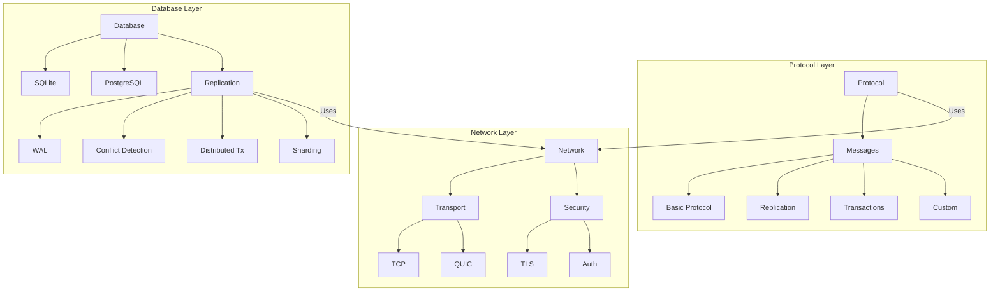
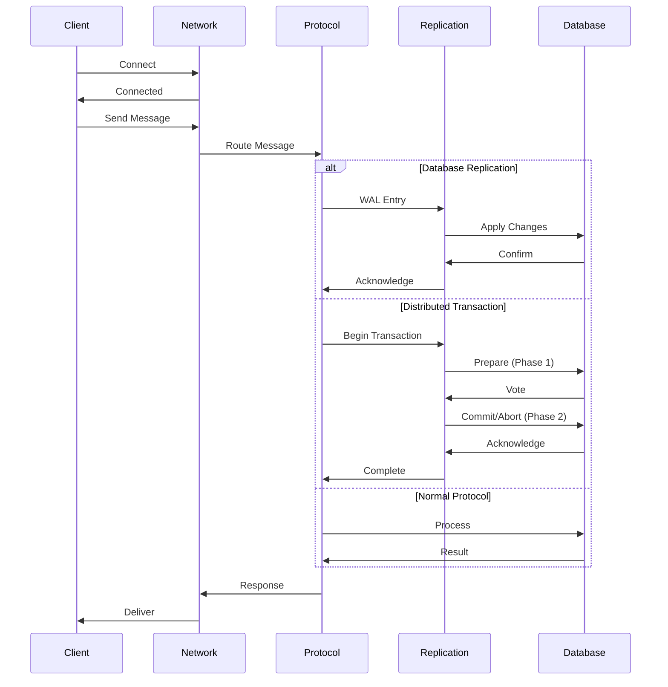
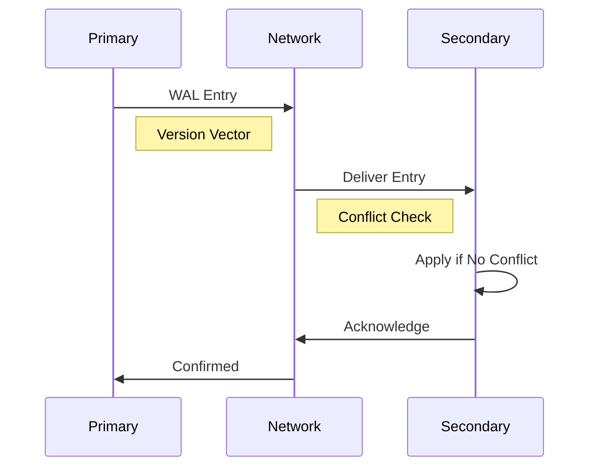
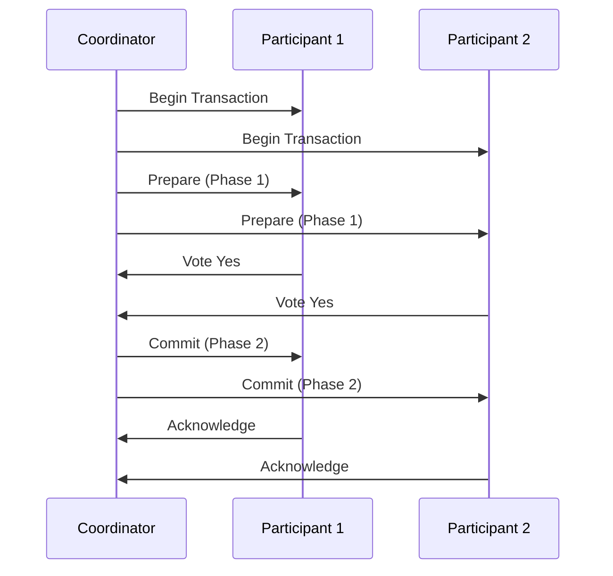
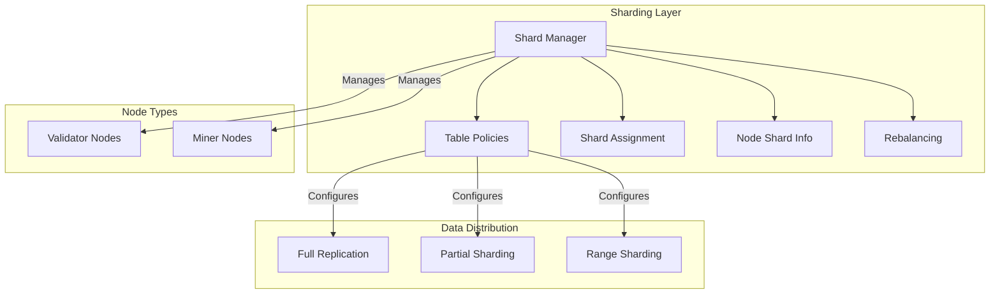

# Mycelium Architecture

## Overview

Mycelium is a distributed data store system with role-based access control, designed to support a network of validator and miner nodes. The system uses a unified network layer for all communication, with specialized protocols built on top for different purposes.

## System Components

### 1. Core Packages

#### network
- Provides unified network communication layer
- Handles peer connections and message routing
- Manages TLS encryption and security
- Supports multiple transport types (TCP, QUIC)
- Features:
  - Connection pooling and management
  - Message routing and delivery
  - Transport abstraction
  - Security and encryption
  - Error handling and recovery
  - Connection retry with backoff
  - Heartbeat monitoring
  - Metrics collection

#### protocol
- Defines core message types and protocol structures
- Handles message serialization/deserialization
- Manages protocol versioning and compatibility
- Implements type-safe message handling
- Supports feature flags for capabilities:
  - Sharding and replication
  - Consensus and encryption
  - Metadata synchronization
  - Auto-scaling and load balancing
  - Failover and leader election
  - Conflict resolution

#### database
- Handles data persistence and synchronization
- Supports both SQLite and PostgreSQL backends
- Provides unified Database trait interface
- Features:
  - Advanced connection pooling
  - Statement caching
  - Type-safe query building
  - SQL parsing and analysis
  - WAL-based replication
  - Conflict detection and resolution
  - Schema versioning and validation
  - Role-based access control
  - Transaction conflict detection
  - Performance metrics
  - Distributed transactions (2PC)
  - Sharding support

#### replication
- Manages database replication and sharding
- Integrates with main network layer
- Handles WAL entry distribution
- Features:
  - Version vector causality tracking
  - SQL-aware conflict detection
  - Primary/Secondary roles
  - WAL management
  - State synchronization
  - Conflict resolution
  - Heartbeat monitoring
  - Connection retry with backoff
  - Comprehensive metrics
  - Transaction-level conflict detection
  - Row-level conflict analysis
  - Automatic conflict resolution
  - Two-phase commit protocol
  - Sharding with configurable policies

### 2. Network Architecture



### 3. Message Flow



### 4. Database Replication



### 5. Distributed Transactions



### 6. Sharding Architecture



## Implementation Details

### 1. Network Integration
```rust
// Network layer provides transport
let network = Arc::new(Network::new(config, TcpTransport));

// Replication uses network layer
let replication = Transport::new(network.clone(), repl_config).await?;

// Send replication message
replication.send_to(peer_addr, Message::WalEntry(entry)).await?;
```

### 2. Message Types
```rust
// Protocol messages
enum Message {
    Handshake(HandshakeData),
    Data(Bytes),
    Custom(Vec<u8>),
}

// Replication messages
enum ReplicationMessage {
    WalEntry(VersionedEntry),
    RequestEntries { after_sequence: u64 },
    ResponseEntries { entries: Vec<VersionedEntry> },
    Status { role: NodeRole, sequence: u64 },
    Heartbeat,
}

// Transaction messages
enum TransactionMessage {
    Begin { tx_id: Uuid, coordinator: SocketAddr },
    Prepare { tx_id: Uuid, operations: Vec<TransactionOp> },
    Vote { tx_id: Uuid, participant: SocketAddr, vote: bool },
    Commit { tx_id: Uuid },
    Abort { tx_id: Uuid, reason: String },
    Ack { tx_id: Uuid, participant: SocketAddr, success: bool },
}
```

### 3. Database Operations
```rust
// Type-safe query building
let query = QueryBuilder::select()
    .table("users")
    .columns(["id", "name"])
    .where_clause(Condition::new("id", Operator::Eq, 1)?)
    .build()?;

// Execute with proper type conversion
let rows = db.query(&query.0, &query.1).await?;
```

### 4. Distributed Transactions
```rust
// Start transaction
let tx_id = tx_manager.begin().await?;

// Add operations
tx_manager.add_operation(tx_id, "UPDATE users SET name = ?", vec![name.into()]).await?;
tx_manager.add_operation(tx_id, "UPDATE orders SET status = ?", vec![status.into()]).await?;

// Commit (starts 2PC)
tx_manager.commit(tx_id).await?;

// Subscribe to events
let mut events = tx_manager.subscribe();
while let Ok(event) = events.recv().await {
    match event {
        TransactionEvent::StateChanged { tx_id, old_state, new_state } => {
            println!("Transaction {} state changed: {:?} -> {:?}", tx_id, old_state, new_state);
        }
        TransactionEvent::Completed { tx_id, success, duration } => {
            println!("Transaction {} completed: success={}, duration={}ms", tx_id, success, duration);
        }
        TransactionEvent::Error { tx_id, error } => {
            println!("Transaction {} error: {}", tx_id, error);
        }
    }
}
```

### 5. Sharding Configuration
```rust
// Define table policy
let policy = TablePolicy {
    table: "users".to_string(),
    replication_factor: 0.5,  // 50% of nodes
    validator_only: true,
    min_validator_copies: 2,
    read_roles: HashSet::from([NodeRole::Primary, NodeRole::Secondary]),
    write_roles: HashSet::from([NodeRole::Primary]),
    shard_keys: vec!["user_id".to_string()],
    range_sharding: true,
    shard_function: None,
};

// Apply policy
shard_manager.set_policy(policy).await?;

// Get shard for query
let shard = shard_manager.get_shard("users", "SELECT * FROM users WHERE user_id = 1").await?;
```

## Security Features

### 1. Network Security
- TLS encryption for all connections
- Certificate-based authentication
- Role-based access control
- Connection retry with backoff
- Heartbeat monitoring
- Node health checks

### 2. Data Security
- Transaction isolation
- SQL injection prevention
- Parameter binding
- Query validation
- Access control lists
- Audit logging

### 3. Replication Security
- Version vector causality
- Conflict detection
- Two-phase commit
- Transaction timeouts
- Node validation
- Shard access control

## Monitoring and Metrics

### 1. Network Metrics
- Connection status
- Message throughput
- Latency statistics
- Error rates
- Retry counts
- Node health

### 2. Database Metrics
- Query performance
- Connection pool stats
- Transaction stats
- Cache hit rates
- Error rates
- Resource usage

### 3. Replication Metrics
- WAL entry counts
- Replication lag
- Conflict rates
- Transaction success/failure
- Shard distribution
- Node load

## Configuration

### 1. Network Configuration
```rust
NetworkConfig {
    local_addr: "0.0.0.0:8080",
    max_connections: 100,
    connection_timeout: Duration::from_secs(30),
    keep_alive_interval: Duration::from_secs(30),
    tls_config: Some(TlsConfig { ... }),
}
```

### 2. Database Configuration
```rust
DatabaseConfig {
    db_type: DatabaseType::PostgreSQL,
    max_connections: 20,
    idle_timeout: Duration::from_secs(300),
    statement_cache_size: 1000,
    retry_interval: Duration::from_secs(5),
}
```

### 3. Transaction Configuration
```rust
TransactionConfig {
    default_timeout: Duration::from_secs(30),
    prepare_timeout: Duration::from_secs(5),
    commit_timeout: Duration::from_secs(5),
    cleanup_interval: Duration::from_secs(60),
    max_transactions: 1000,
}
```

### 4. Sharding Configuration
```rust
ShardConfig {
    default_replication_factor: 0.5,
    min_validator_copies: 2,
    max_shard_size: 1024 * 1024 * 1024,  // 1GB
    rebalance_interval: Duration::from_secs(3600),
    load_threshold: 0.8,
}
```

## Best Practices

1. **Transaction Management**
   - Keep transactions short
   - Use appropriate timeouts
   - Handle failures gracefully
   - Monitor transaction metrics
   - Use proper isolation levels

2. **Sharding Strategy**
   - Choose appropriate shard keys
   - Balance data distribution
   - Consider access patterns
   - Monitor shard sizes
   - Plan for rebalancing

3. **Error Handling**
   - Implement proper retries
   - Use exponential backoff
   - Log errors appropriately
   - Monitor error rates
   - Have fallback strategies

4. **Performance Optimization**
   - Use connection pooling
   - Enable statement caching
   - Monitor query performance
   - Optimize shard distribution
   - Regular maintenance

5. **Security**
   - Regular certificate rotation
   - Proper access control
   - Input validation
   - Audit logging
   - Regular security reviews