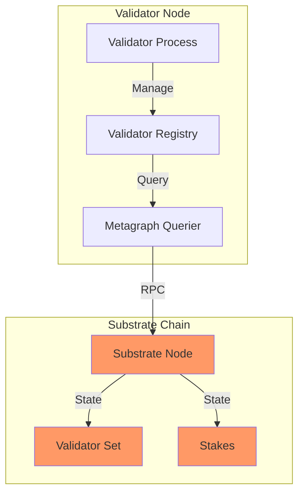
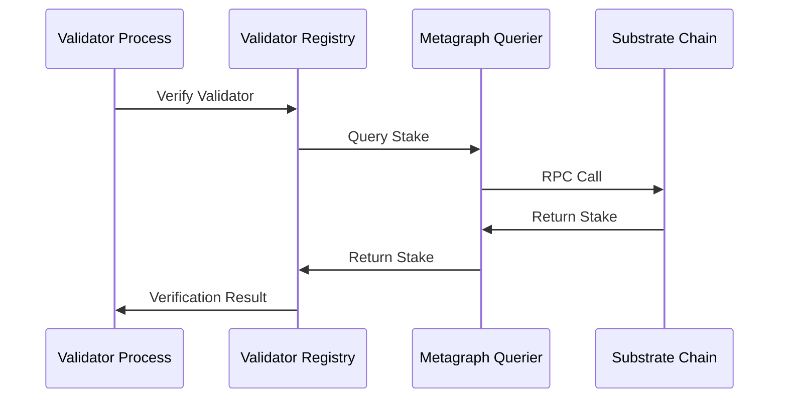
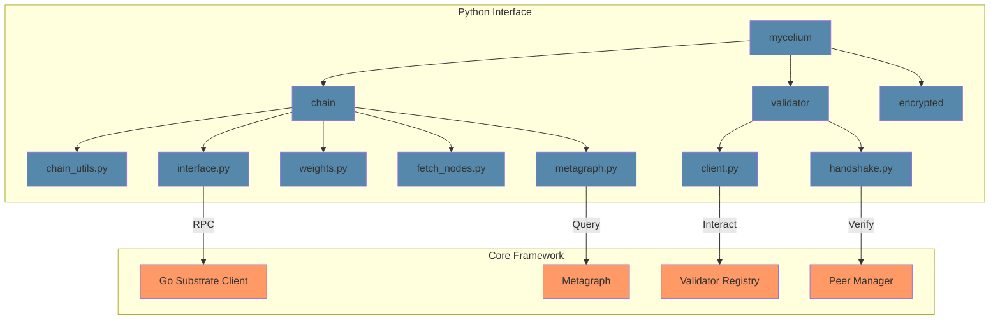
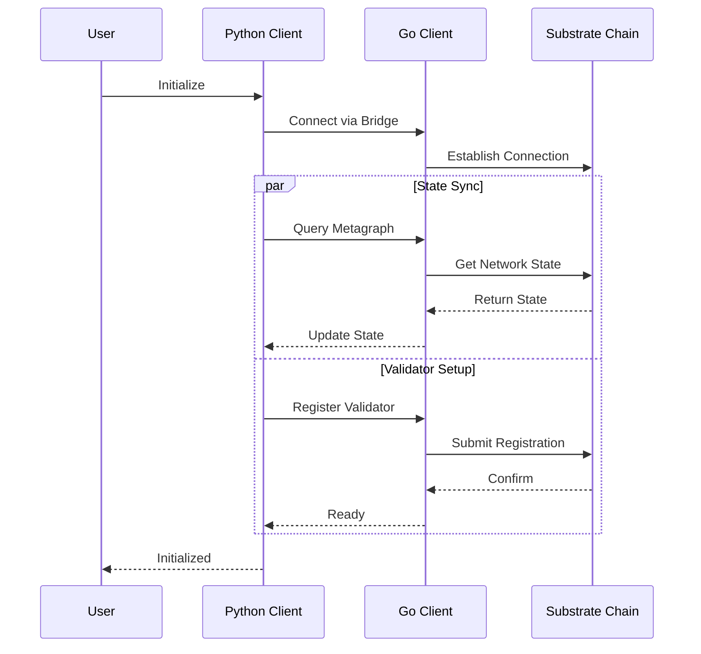

# Mycelium Architecture

## Overview

Mycelium is a distributed data store system with role-based access control, designed to support a network of validator nodes (which participate in consensus) and miner nodes (which process work). Each validator node runs a Consensus Manager component, with leadership determined through weighted Raft election based on validator tiers and performance metrics.

## System Components

### 1. Core Packages

#### metagraph
- Direct interaction with the Substrate blockchain
- Queries validator information, stakes, and network state
- Handles all blockchain-related operations through the Go Substrate RPC client
- No Python dependencies or bridges required

#### peer
- Manages validator discovery and status tracking
- Maintains registry of active validators
- Handles peer verification and stake checking
- Uses metagraph for blockchain queries

#### util
- Common utilities shared across packages
- IP address handling and validation
- Network-related helper functions

## System Architecture Diagram

## Component Interactions

### 1. Validator Verification Flow

### 2. Data Architecture

#### Direct Substrate Integration
- Uses go-substrate-rpc-client for chain interaction
- No intermediate Python or gRPC layers
- Efficient direct state queries
- Real-time stake and validator information

#### Validator Registry
- In-memory cache of validator status
- Periodic cleanup of inactive validators
- Thread-safe concurrent access
- Configurable minimum stake requirements

### 3. Security Model

#### Stake-based Validation
- Minimum stake requirement for validators
- Real-time stake verification through Substrate
- Automatic deactivation of validators below minimum stake
- Cached validation results with configurable TTL

#### Network Security
- IP address validation and sanitization
- Port range validation
- SS58 address format verification
- Signature verification for all operations

## Python Interface Layer

### Overview

The Python interface layer provides a comprehensive API for interacting with the Mycelium network. It serves as a drop-in replacement for the Fiber library, offering enhanced functionality and improved reliability.

### Package Structure

### Integration Flow

### Core Components

#### Root Package (`mycelium/`)
- `__init__.py`: Package initialization, version information, and exports of core modules
  - Exports: `chain`, `encrypted`
  - Version: 0.1.0
  - Author: Mycelium Contributors

#### Chain Package (`mycelium/chain/`)

##### `interface.py`
- Low-level substrate interface for Mycelium network
- Handles direct communication with substrate nodes
- Features:
  - Connection management with retry logic
  - Storage queries (single and map)
  - Extrinsic submission
  - Block information retrieval
  - Account queries
  - Storage subscriptions
  - Custom error handling

##### `chain_utils.py`
- High-level chain interaction utilities
- Bridges Go substrate client with Python
- Key features:
  - Substrate connection management
  - Stake operations
  - Signature verification
  - Axon endpoint registration
  - Network queries
  - Block information

##### `weights.py`
- Weight management and normalization utilities
- Features:
  - Weight normalization functions
  - Conversion between float and u16 formats
  - Weight validation
  - Weight matrix computation

##### `fetch_nodes.py`
- Node discovery and filtering utilities
- Features:
  - Active node retrieval
  - Filtering by:
    - Stake amount
    - Rank
    - Trust score
    - Consensus score
    - Incentive
    - Dividends
    - Emission
    - Version
    - Prometheus availability
  - Multi-criteria node selection

##### `metagraph.py`
- Network state management and queries
- Features:
  - Network state synchronization
  - Validator information tracking
  - Weight matrix management
  - Network statistics
  - Performance metrics

#### Validator Package (`mycelium/validator/`)

##### `client.py`
- Validator client implementation
- Features:
  - Weight setting
  - Axon endpoint management
  - Stake operations
  - Registration verification
  - Prometheus integration

##### `handshake.py`
- Validator handshake protocol implementation
- Features:
  - Secure connection establishment
  - Credential verification
  - Protocol version negotiation

#### Encrypted Package (`mycelium/encrypted/`)
- Cryptographic utilities and secure communication
- *Note: Implementation details pending*

## Future Considerations

### 1. Framework Enhancements
[Previous content about framework enhancements remains...]

### 2. Python Interface Extensions
1. Custom validator implementations
2. Additional cryptographic schemes
3. New network protocols
4. Custom weight strategies
5. Alternative node selection algorithms

## Security Considerations

### Framework Security
[Previous content about framework security remains...]

### Python Interface Security
1. All network communications are encrypted
2. Private keys never leave the client
3. Signature verification for all operations
4. Retry logic with exponential backoff
5. Error handling at all layers
6. Input validation for all public methods

## Dependencies

### Framework Dependencies
[Previous content about framework dependencies remains...]

### Python Interface Dependencies
- `substrate-interface`: Core substrate communication
- `py-sr25519-bindings`: Cryptographic operations
- `py-ed25519-zebra-bindings`: Additional cryptography support
- `py-bip39-bindings`: Mnemonic handling
- `base58`: Address encoding
- `cryptography`: General cryptographic operations
- `pycryptodome`: Additional cryptographic primitives

#### Optional Dependencies
- `numpy`: Numerical operations
- `pandas`: Data handling
- `torch`: Machine learning support 