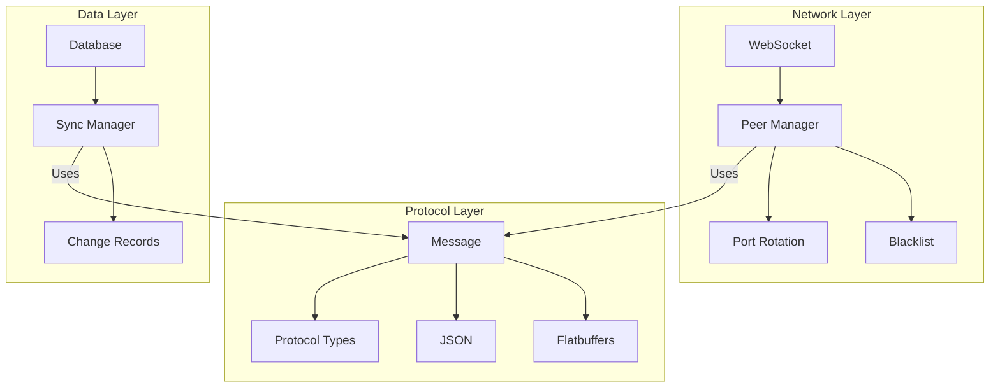
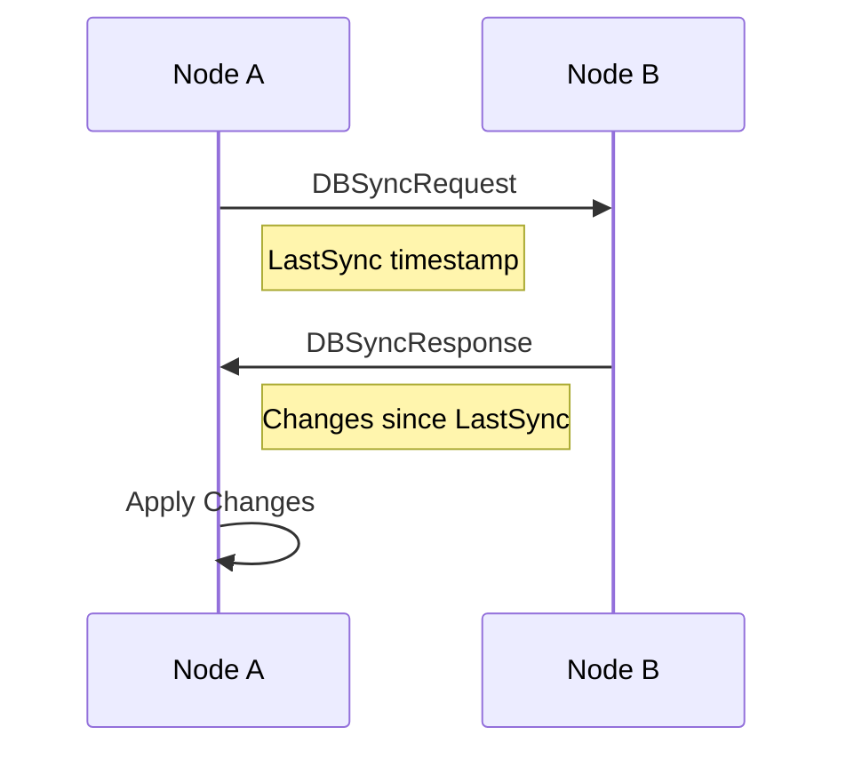
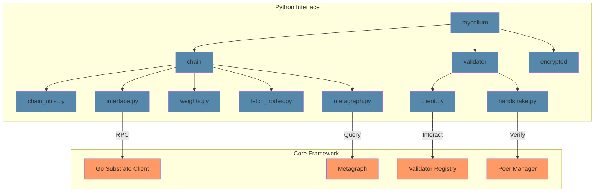

# Mycelium Architecture

## Overview

Mycelium is a distributed data store system with role-based access control, designed to support a network of validator nodes. The system uses Flatbuffers for efficient message serialization and WebSocket connections for peer-to-peer communication.

## System Components

### 1. Core Packages

#### protocol
- Defines core message types and protocol structures using Flatbuffers
- Handles message serialization/deserialization
- Manages protocol versioning and compatibility
- Implements type-safe message handling

#### peer
- Manages peer-to-peer networking and WebSocket connections
- Handles peer discovery and connection management
- Implements port rotation for security
- Maintains blacklist of invalid peers
- Uses protocol package for message handling

#### metagraph
- Interacts with Substrate blockchain
- Tracks validator stakes and status
- Manages network state synchronization
- Provides chain querying interface

#### database
- Handles data persistence and synchronization
- Manages change tracking and propagation
- Implements sync manager for peer synchronization
- Provides atomic operations and consistency

#### identity
- Manages node identity and credentials
- Handles cryptographic operations
- Manages network addressing information
- Tracks validator status and stake

### 2. Protocol Structure



### 3. Message Types

Current protocol supports:
- Handshake/HandshakeResponse
- Ping/Pong
- Gossip
- Sync
- DBSyncReq/DBSyncResp
- BlacklistSync

### 4. Security Features

- Port rotation for connection security
- Stake-based validator verification
- Blacklist management for invalid peers
- Cryptographic message signing
- JSON/Flatbuffers hybrid encoding

### 5. Database Synchronization



## Implementation Details

### 1. Message Structure
```go
type Message struct {
    Version   string
    Type      MessageType
    SenderID  string
    Timestamp time.Time
    Nonce     uint64
    Payload   map[string]interface{}
    Signature string
}
```

### 2. Node Status
```go
type NodeStatus struct {
    ID              string
    Version         string
    StartTime       time.Time
    LastSync        time.Time
    LastHeartbeat   time.Time
    IsActive        bool
    Status          string
    PeerCount       int
    ServingRate     float64
    SyncProgress    float64
    ResponseLatency time.Duration
    MemoryUsage     uint64
    CPUUsage        float64
}
```

## Python Interface

### Overview
The Python interface provides a high-level API for interacting with the Mycelium network. It serves as a drop-in replacement for the Fiber library, offering enhanced functionality and improved reliability.

### Package Structure



### Core Components

#### Root Package (`mycelium/`)
- `__init__.py`: Package initialization and version information
  - Exports: `chain`, `validator`, `encrypted`
  - Version: Current version from Go implementation
  - Author: Mycelium Contributors

#### Chain Package (`mycelium/chain/`)
- `interface.py`: Low-level substrate interface
  - Connection management with retry logic
  - Storage queries and extrinsic submission
  - Block information retrieval
  - Account queries
  - Storage subscriptions

- `chain_utils.py`: High-level chain interaction utilities
  - Substrate connection management
  - Stake operations
  - Signature verification
  - Network queries

- `metagraph.py`: Network state management
  - Network state synchronization
  - Validator information tracking
  - Network statistics
  - Performance metrics

#### Validator Package (`mycelium/validator/`)
- `client.py`: Validator client implementation
  - Weight setting
  - Axon endpoint management
  - Stake operations
  - Registration verification
  - Prometheus integration

- `handshake.py`: Validator handshake protocol
  - Secure connection establishment
  - Credential verification
  - Protocol version negotiation

#### Encrypted Package (`mycelium/encrypted/`)
- Cryptographic utilities and secure communication
- Implements protocol encryption layer
- Handles secure message exchange

### Dependencies

#### Required Dependencies
- `substrate-interface`: Core substrate communication
- `sr25519-bindings`: Cryptographic operations
- `cryptography`: General cryptographic operations
- `websockets`: WebSocket client implementation
- `prometheus-client`: Metrics and monitoring

#### Optional Dependencies
- `numpy`: Numerical operations (for weight calculations)
- `pandas`: Data handling (for analytics)

## Future Considerations

1. Enhanced protocol versioning
2. Additional message types
3. Advanced peer discovery mechanisms
4. Extended security features
5. Performance optimizations
6. Extended Python API capabilities
7. Additional validator features
8. Enhanced analytics and monitoring 